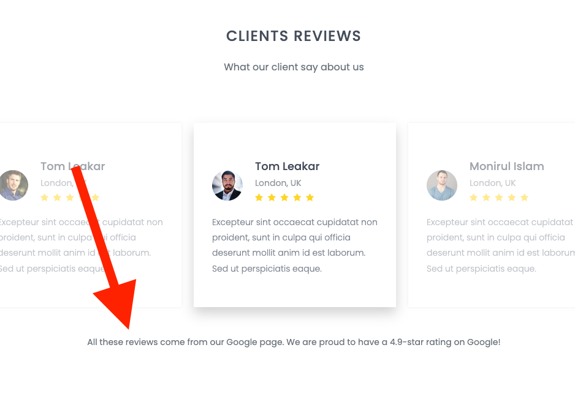

# Exercice "Not My Code"

## Travail

Ouvrez le dossier du projet dans VS Code et lancez "Live Server" pour visualiser le site. Vous devrez modifier le code HTML et CSS pour répondre aux demandes du client.

## Consignes

Répondez aux demandes du client en modifiant le code HTML et CSS du site. **Faites un commit après chaque modification**.

1.  Le lien n'est pas actif autour de toute la carte de catégories, **il faut adapter le code pour que le lien soit actif sur toute la carte**.  
    

1.  Le client aimerait que ces cartes aient des coins beaucoup plus arrondis. **Ajoutez des coins arrondis aux cartes**.
    

1.  La charte graphique a changé. Il faut donc **modifier les couleurs du site pour qu'elles correspondent à la nouvelle charte graphique**. La nouvelle couleur principale est le `#3b9c1e`.

1.  Le client aimerait que le mot **"Explore"** dans la navigation ainsi que le titre de la section soit renommé en **"Discover"**. Faites ce changement sans oublier le pied de page.

1.  Le client aimerait afficher que les 3 premiers résulats de la section "Discover". Enlevez les autres résultats.

1.  Le client trouve que **le titre des sections est trop petit**. Augmentez la taille de la police des titres de section.

1.  Le client aimerait qu'on ajoute un texte en dessous des "Clients Reviews" pour expliquer que les avis sont issus de Google Reviews. Le texte à ajouter: "All these reviews come from our Google page. We are proud to have a 4.9-star rating on Google!"
    

1.  Le client veut que vous changiez l'image du header (en-tête) pour une image de Fribourg.
